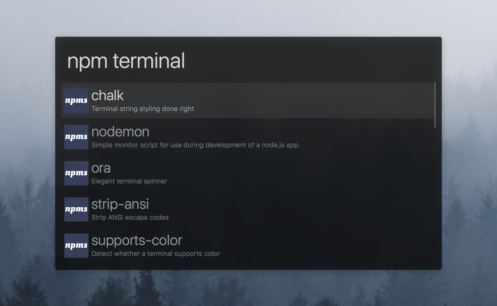
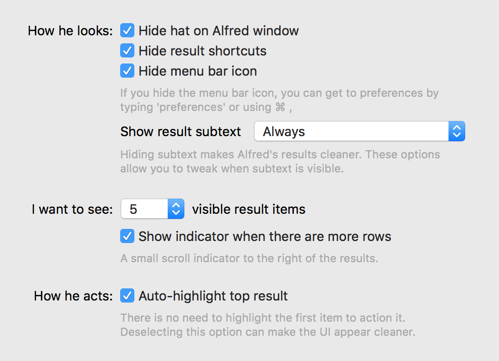

# alfred-simple-dark

> Simple dark theme for [Alfred](https://www.alfredapp.com)

## Install

[Install the theme.](https://www.alfredapp.com/extras/theme/xBZHgCAYMO/)

*You need the [Powerpack](https://www.alfredapp.com/powerpack/) for custom themes.*

## Options

Use the following options to have it look exactly like in the screenshot above.

## Related

- [alfred-simple](https://github.com/sindresorhus/alfred-simple) - Light version of this theme

## License

MIT © [Sindre Sorhus](https://sindresorhus.com), [Christoph Uschkrat](https://c.uschkrat.com)
